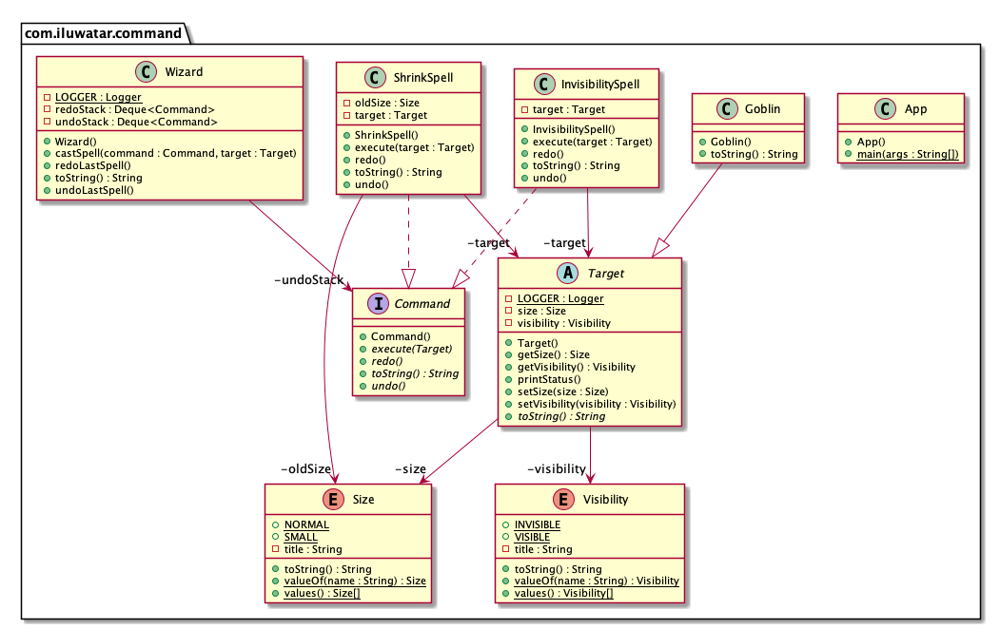

## Also known as
Action, Transaction

## Intent
Encapsulate a request as an object, thereby letting you parameterize clients with different requests, queue or log requests, and support undoable operations.

## Explanation
Real world example

> There is a wizard casting spells on a goblin. The spells are executed on the goblin one by one. The first spell shrinks the goblin and the second makes him invisible. Then the wizard reverses the spells one by one. Each spell here is a command object that can be undone.

In plain words

> Storing requests as command objects allows performing an action or undoing it at a later time.

Wikipedia says

> In object-oriented programming, the command pattern is a behavioral design pattern in which an object is used to encapsulate all information needed to perform an action or trigger an event at a later time.

**Programmatic Example**

Here's the sample code with wizard and goblin. Let's start from the wizard class.

```java
public class Wizard {

  private static final Logger LOGGER = LoggerFactory.getLogger(Wizard.class);

  private final Deque<Command> undoStack = new LinkedList<>();
  private final Deque<Command> redoStack = new LinkedList<>();

  public Wizard() {}

  public void castSpell(Command command, Target target) {
    LOGGER.info("{} casts {} at {}", this, command, target);
    command.execute(target);
    undoStack.offerLast(command);
  }

  public void undoLastSpell() {
    if (!undoStack.isEmpty()) {
      var previousSpell = undoStack.pollLast();
      redoStack.offerLast(previousSpell);
      LOGGER.info("{} undoes {}", this, previousSpell);
      previousSpell.undo();
    }
  }

  public void redoLastSpell() {
    if (!redoStack.isEmpty()) {
      var previousSpell = redoStack.pollLast();
      undoStack.offerLast(previousSpell);
      LOGGER.info("{} redoes {}", this, previousSpell);
      previousSpell.redo();
    }
  }

  @Override
  public String toString() {
    return "Wizard";
  }
}
```

Next we present the spell hierarchy.

```java
public interface Command {

  void execute(Target target);

  void undo();

  void redo();

  String toString();
}

public class InvisibilitySpell implements Command {

  private Target target;

  @Override
  public void execute(Target target) {
    target.setVisibility(Visibility.INVISIBLE);
    this.target = target;
  }

  @Override
  public void undo() {
    if (target != null) {
      target.setVisibility(Visibility.VISIBLE);
    }
  }

  @Override
  public void redo() {
    if (target != null) {
      target.setVisibility(Visibility.INVISIBLE);
    }
  }

  @Override
  public String toString() {
    return "Invisibility spell";
  }
}

public class ShrinkSpell implements Command {

  private Size oldSize;
  private Target target;

  @Override
  public void execute(Target target) {
    oldSize = target.getSize();
    target.setSize(Size.SMALL);
    this.target = target;
  }

  @Override
  public void undo() {
    if (oldSize != null && target != null) {
      var temp = target.getSize();
      target.setSize(oldSize);
      oldSize = temp;
    }
  }

  @Override
  public void redo() {
    undo();
  }

  @Override
  public String toString() {
    return "Shrink spell";
  }
}
```

And last we have the goblin who's the target of the spells.

```java
public abstract class Target {

  private static final Logger LOGGER = LoggerFactory.getLogger(Target.class);

  private Size size;

  private Visibility visibility;

  public Size getSize() {
    return size;
  }

  public void setSize(Size size) {
    this.size = size;
  }

  public Visibility getVisibility() {
    return visibility;
  }

  public void setVisibility(Visibility visibility) {
    this.visibility = visibility;
  }

  @Override
  public abstract String toString();

  public void printStatus() {
    LOGGER.info("{}, [size={}] [visibility={}]", this, getSize(), getVisibility());
  }
}

public class Goblin extends Target {

  public Goblin() {
    setSize(Size.NORMAL);
    setVisibility(Visibility.VISIBLE);
  }

  @Override
  public String toString() {
    return "Goblin";
  }

}
```

Finally here's the whole example in action.

```java
var wizard = new Wizard();
var goblin = new Goblin();
goblin.printStatus();
// Goblin, [size=normal] [visibility=visible]
wizard.castSpell(new ShrinkSpell(), goblin);
// Wizard casts Shrink spell at Goblin
goblin.printStatus();
// Goblin, [size=small] [visibility=visible]
wizard.castSpell(new InvisibilitySpell(), goblin);
// Wizard casts Invisibility spell at Goblin
goblin.printStatus();
// Goblin, [size=small] [visibility=invisible]
wizard.undoLastSpell();
// Wizard undoes Invisibility spell
goblin.printStatus();
// Goblin, [size=small] [visibility=visible]
```

## Class diagram


## Applicability
Use the Command pattern when you want to

* parameterize objects by an action to perform. You can express such parameterization in a procedural language with a callback function, that is, a function that's registered somewhere to be called at a later point. Commands are an object-oriented replacement for callbacks.
* specify, queue, and execute requests at different times. A Command object can have a lifetime independent of the original request. If the receiver of a request can be represented in an address space-independent way, then you can transfer a command object for the request to a different process and fulfill the request there
* support undo. The Command's execute operation can store state for reversing its effects in the command itself. The Command interface must have an added Unexecute operation that reverses the effects of a previous call to execute. Executed commands are stored in a history list. Unlimited-level undo and redo is achieved by traversing this list backwards and forwards calling unexecute and execute, respectively
* support logging changes so that they can be reapplied in case of a system crash. By augmenting the Command interface with load and store operations, you can keep a persistent log of changes. Recovering from a crash involves reloading logged commands from disk and re-executing them with the execute operation
* structure a system around high-level operations build on primitive operations. Such a structure is common in information systems that support transactions. A transaction encapsulates a set of changes to data. The Command pattern offers a way to model transactions. Commands have a common interface, letting you invoke all transactions the same way. The pattern also makes it easy to extend the system with new transactions

## Typical Use Case

* to keep a history of requests
* implement callback functionality
* implement the undo functionality

## Real world examples

* [java.lang.Runnable](http://docs.oracle.com/javase/8/docs/api/java/lang/Runnable.html)
* [org.junit.runners.model.Statement](https://github.com/junit-team/junit4/blob/master/src/main/java/org/junit/runners/model/Statement.java)
* [Netflix Hystrix](https://github.com/Netflix/Hystrix/wiki)
* [javax.swing.Action](http://docs.oracle.com/javase/8/docs/api/javax/swing/Action.html)

## Credits

* [Design Patterns: Elements of Reusable Object-Oriented Software](https://www.amazon.com/gp/product/0201633612/ref=as_li_tl?ie=UTF8&camp=1789&creative=9325&creativeASIN=0201633612&linkCode=as2&tag=javadesignpat-20&linkId=675d49790ce11db99d90bde47f1aeb59)
* [Head First Design Patterns: A Brain-Friendly Guide](https://www.amazon.com/gp/product/0596007124/ref=as_li_tl?ie=UTF8&camp=1789&creative=9325&creativeASIN=0596007124&linkCode=as2&tag=javadesignpat-20&linkId=6b8b6eea86021af6c8e3cd3fc382cb5b)
* [Refactoring to Patterns](https://www.amazon.com/gp/product/0321213351/ref=as_li_tl?ie=UTF8&camp=1789&creative=9325&creativeASIN=0321213351&linkCode=as2&tag=javadesignpat-20&linkId=2a76fcb387234bc71b1c61150b3cc3a7)
* [J2EE Design Patterns](https://www.amazon.com/gp/product/0596004273/ref=as_li_tl?ie=UTF8&camp=1789&creative=9325&creativeASIN=0596004273&linkCode=as2&tag=javadesignpat-20&linkId=f27d2644fbe5026ea448791a8ad09c94)
